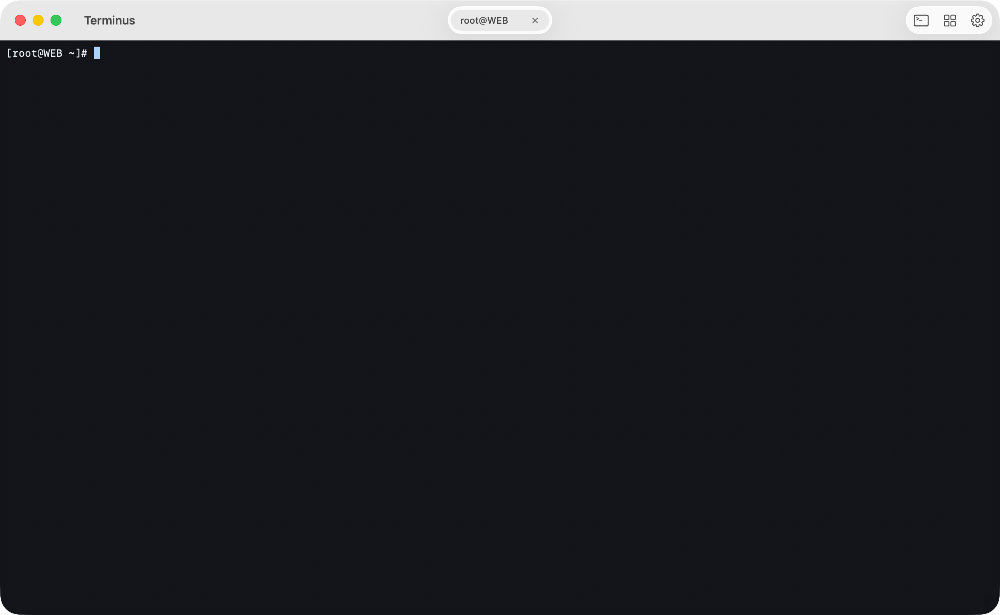
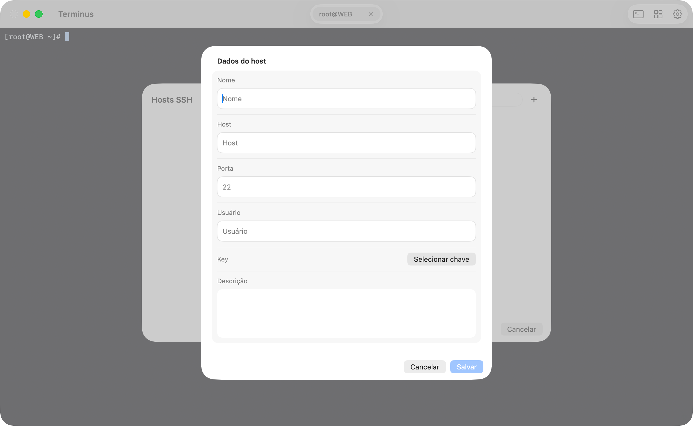
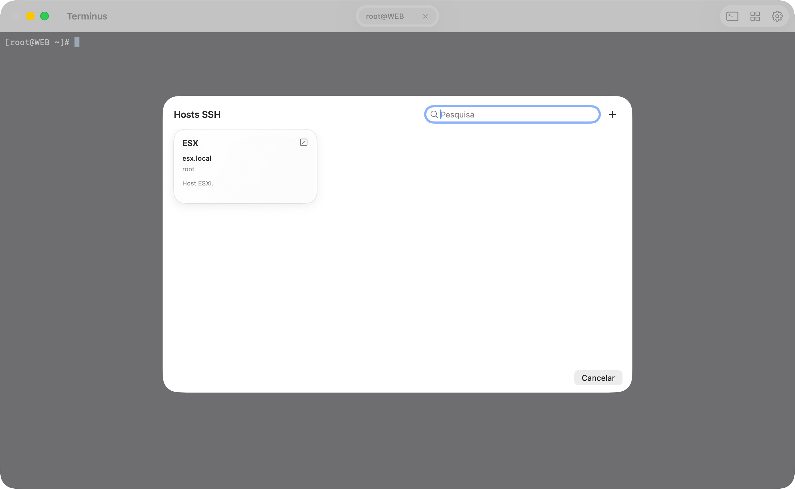
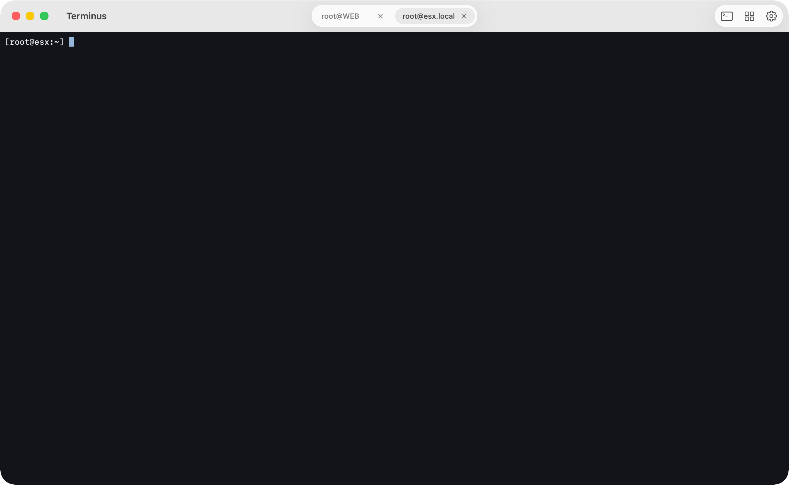
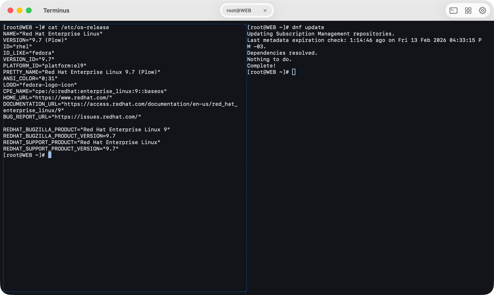

# Terminus

Um emulador de terminal para macOS baseado na biblioteca [SwiftTerm](https://github.com/migueldeicaza/SwiftTerm).

### Pre-requisitos

- macOS 15 ou superior

### Recursos

- Multitab - execute múltiplas abas do terminal, incluindo sessões remotas (SSH).
- Split terminal - use os atalhos `⌘D` e `⌘⇧D` para dividir uma sessão local ou remota (SSH).
- Cadastro de Hosts SSH - cadastre Hosts SSH para fácil acesso.

### Atalhos

| :Atalho: | Descrição |
|:------:|------------|
| :`⌘D`: | Divide o terminal ativo verticalmente |
| :`⌘⇧D`: | Divide o terminal ativo horizontalmente |
| :`⌘⌃W`: | Fecha o painel ativo |

### Screenshots

